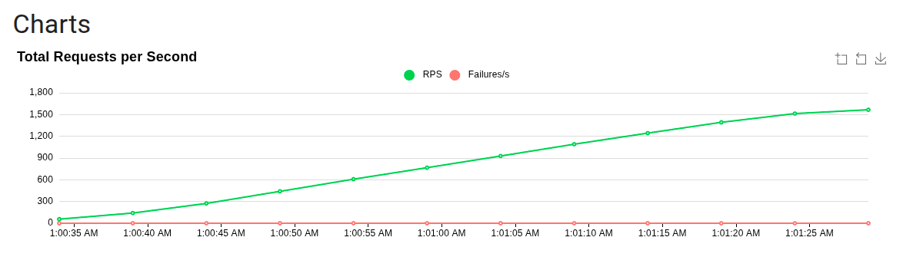
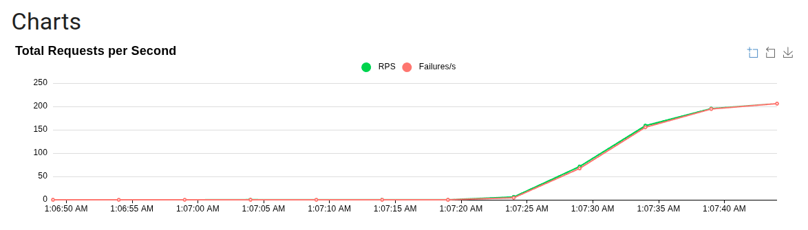

# Query Performance Demo

Demo project for query performance analysis comparing LEFT JOIN vs UNION ALL strategies.

## Setup

1. Create PostgreSQL database:
```bash
psql -d postgres -c "CREATE DATABASE query_performance_demo;"
```

2. Run the application (auto-creates tables and loads 5M test records):
```bash
./gradlew bootRun
```

3. Run performance tests:
```bash
./gradlew test --tests "QueryPerformanceTest" --info
```

## Test Data

| Table | Count |
|-------|-------|
| distribution_group / distribution_group_2 | 5,000,000 |
| distribution_group_matching / distribution_group_matching_2 | 5,000,000 |
| task | 5,000,000 |
| account / account_2 | 100 |
| account_group / account_group_2 | 20 |
| skill / skill_2 | 50 |

**Note**: Tables with `_2` suffix have additional indexes for Scenario 3:
- `idx_skill2_code` on `skill_2(code)`
- `idx_dg2_state_id` on `distribution_group_2(state, id)`
- `idx_dgm2_dg_id_type_pointer` on `distribution_group_matching_2(distribution_group_id, type, pointer)`

## Query Comparison

### Scenario 1: UNION ALL (No indexes)

```sql
SELECT dg.id, dg.state FROM distribution_group dg
JOIN distribution_group_matching dgm ON dgm.distribution_group_id = dg.id
JOIN skill s ON dgm.type = 'SKILL_CODE' AND dgm.pointer = s.code
WHERE dg.state = 'WAITING'

UNION ALL

SELECT dg.id, dg.state FROM distribution_group dg
JOIN distribution_group_matching dgm ON dgm.distribution_group_id = dg.id
JOIN account a ON dgm.type = 'ACCOUNT_ID' AND dgm.pointer = CAST(a.id AS TEXT)
WHERE dg.state = 'WAITING'

UNION ALL

SELECT dg.id, dg.state FROM distribution_group dg
JOIN distribution_group_matching dgm ON dgm.distribution_group_id = dg.id
JOIN account_group ag ON dgm.type = 'ACCOUNT_GROUP_ID' AND dgm.pointer = CAST(ag.id AS TEXT)
WHERE dg.state = 'WAITING'

ORDER BY id
LIMIT 100 OFFSET 0;
```

### Scenario 2: LEFT JOIN + GROUP BY (No indexes)

```sql
SELECT dg.id, dg.state
FROM distribution_group dg
JOIN distribution_group_matching dgm ON dgm.distribution_group_id = dg.id
LEFT JOIN skill s ON dgm.type = 'SKILL_CODE' AND dgm.pointer = s.code
LEFT JOIN account a ON dgm.type = 'ACCOUNT_ID' AND dgm.pointer = CAST(a.id AS TEXT)
LEFT JOIN account_group ag ON dgm.type = 'ACCOUNT_GROUP_ID' AND dgm.pointer = CAST(ag.id AS TEXT)
WHERE dg.state = 'WAITING'
  AND (s.id IS NOT NULL OR a.id IS NOT NULL OR ag.id IS NOT NULL)
GROUP BY dg.id, dg.state
ORDER BY dg.id
LIMIT 100 OFFSET 0;
```

### Scenario 3: LEFT JOIN + GROUP BY + Indexes

Uses `_2` tables with indexes:

```sql
SELECT dg.id, dg.state
FROM distribution_group_2 dg
JOIN distribution_group_matching_2 dgm ON dgm.distribution_group_id = dg.id
LEFT JOIN skill_2 s ON dgm.type = 'SKILL_CODE' AND dgm.pointer = s.code
LEFT JOIN account_2 a ON dgm.type = 'ACCOUNT_ID' AND dgm.pointer = CAST(a.id AS TEXT)
LEFT JOIN account_group_2 ag ON dgm.type = 'ACCOUNT_GROUP_ID' AND dgm.pointer = CAST(ag.id AS TEXT)
WHERE dg.state = 'WAITING'
  AND (s.id IS NOT NULL OR a.id IS NOT NULL OR ag.id IS NOT NULL)
GROUP BY dg.id, dg.state
ORDER BY dg.id
LIMIT 100 OFFSET 0;
```

## Performance Results (5M Records)

| Scenario | Avg Time | Description |
|----------|----------|-------------|
| Scenario 1: UNION ALL | ~2,543 ms | No indexes |
| Scenario 2: LEFT JOIN + GROUP BY | ~358 ms | No indexes |
| Scenario 3: LEFT JOIN + GROUP BY + Index | ~1.8 ms | With indexes |

**Key Findings**:
- LEFT JOIN + GROUP BY is **~7x faster** than UNION ALL (without indexes)
- Adding indexes to LEFT JOIN + GROUP BY provides **~199x improvement** (358 ms → 1.8 ms)
- Total improvement from Scenario 1 → 3: **~1,413x faster** (2,543 ms → 1.8 ms)

## EXPLAIN ANALYZE Results

### Scenario 1: UNION ALL (~2,543 ms avg)

```
Limit (actual time=501..508 ms, rows=100)
  -> Gather Merge (sort results from workers)
       -> Sort (ORDER BY id)
             -> Parallel Append (combines 3 sub-queries)
                   +-- Hash Join: dg + dgm + account_group (111k rows each worker)
                   +-- Hash Join: dg + dgm + account (166k rows each worker)
                   +-- Hash Join: dg + dgm + skill (333k rows)
```

Key points:
- `Parallel Seq Scan on distribution_group`: Scans 3 times (once per sub-query)
- `Parallel Seq Scan on distribution_group_matching`: Scans 3 times with filter
- `Rows Removed by Filter: 666667`: Each sub-query filters 2/3 of matching table
- `Sort` after append: Must collect all 5M rows before sorting
- `Limit` NOT pushed down: Can't limit until after UNION ALL + ORDER BY

### Scenario 2: LEFT JOIN + GROUP BY (~358 ms avg)

```
Limit (actual time=66..71 ms, rows=100)
  -> Group (rows=100)
       -> Nested Loop Left Join (account_group)
             -> Nested Loop Left Join (account)
                   -> Nested Loop Left Join (skill)
                         -> Merge Join (dg + dgm)
                               +-- Gather Merge (dgm) <- Parallel scan + sort
                               +-- Index Scan (dg) <- Uses PRIMARY KEY index
```

Key points:
- `Index Scan on distribution_group_pkey`: Uses index, only reads 100 rows needed
- `Merge Join`: Efficiently joins sorted data
- `Nested Loop Left Join`: Small tables (100 accounts, 20 groups, 50 skills) - fast
- `Limit` pushed down: Stops early after finding 100 rows

### Scenario 3: LEFT JOIN + GROUP BY + Index (~1.8 ms avg)

```
Limit (actual time=0.5..0.8 ms, rows=100)
  -> Group (rows=100)
       -> Nested Loop Left Join (account_group_2)
             -> Nested Loop Left Join (account_2)
                   -> Nested Loop Left Join (skill_2)
                         -> Merge Join (dg + dgm)
                               +-- Index Scan (dgm) <- Uses idx_dgm2_dg_id_type_pointer
                               +-- Index Scan (dg) <- Uses idx_dg2_state_id
```

Key points:
- `idx_dg2_state_id`: Composite index on (state, id) enables efficient filtering + ordering
- `idx_dgm2_dg_id_type_pointer`: Covers all join conditions, eliminates sequential scans
- `idx_skill2_code`: Enables index lookup instead of scan for skill matching
- All operations use indexes: No sequential scans needed

## Key Differences

| Factor | Scenario 1 (UNION ALL) | Scenario 2 (LEFT JOIN) | Scenario 3 (LEFT JOIN + Index) |
|--------|------------------------|------------------------|--------------------------------|
| Table scans | 3x distribution_group, 3x matching | 1x each table | 0 (all index scans) |
| Can use LIMIT early | No (must sort first) | Yes | Yes |
| Parallelism | Good | Limited | Not needed |
| Index usage | Hash joins | Uses PK index only | Full composite indexes |
| Avg Time | ~2,543 ms | ~358 ms | ~1.8 ms |

## Why LEFT JOIN + Index is Fastest

**At 5M rows**, LEFT JOIN + GROUP BY + Index is ~1,413x faster than UNION ALL because:

1. **Composite indexes**: `idx_dg2_state_id(state, id)` covers both WHERE and ORDER BY
2. **Covering index for joins**: `idx_dgm2_dg_id_type_pointer` eliminates table lookups
3. **Index-only scans**: All required data retrieved from indexes
4. **Early LIMIT pushdown**: Stops after finding 100 rows with minimal I/O

**Scenario 1 → 2 (Query Strategy Improvement)**:
- LEFT JOIN is ~7x faster (2,543 ms → 358 ms)
- Single table scan vs 3x scans for UNION ALL
- LIMIT can be applied early vs must sort all results first

**Scenario 2 → 3 (Index Optimization)**:
- LEFT JOIN: 358 ms → 1.8 ms (**199x improvement**)
- Proper indexing provides orders of magnitude improvement

**Total Improvement (Scenario 1 → 3)**:
- UNION ALL → LEFT JOIN + Index: 2,543 ms → 1.8 ms (**~1,413x faster**)

## Load Test Results

Slow queries don't just affect individual requests - they can crash your entire system.

### Test Environment

```
HikariCP max-pool-size: 50
Tomcat max-threads: 200
Test tool: Locust
```

### Test Results

| Scenario | Users | Requests | Failure Rate | Avg Response | Req/s |
|----------|-------|----------|--------------|--------------|-------|
| Fast Only (2ms query) | 500 | 56,575 | **0%** | 11ms | 945 |
| Slow Only (2.5s query) | 100 | 4,178 | **98.56%** | 637ms | 1.6 |

#### Fast Query (2ms) - Stable at 500 users


#### Slow Query (2.5s) - Crashed at 100 users


### What Happened with Slow Queries?

With only **100 concurrent users** hitting the slow endpoint:

```
Error breakdown:
- ConnectionRefusedError: 4,094 (server stopped accepting connections)
- 500 Server Error: 20 (DB connection pool exhausted)
- RemoteDisconnected: 4 (connection dropped)

Total: 98.56% failure rate
```

**The server completely collapsed.**

### Why Does This Happen?

```
DB Connection Pool Math:
- Pool size: 50 connections
- Query time: 2.5 seconds
- Max throughput: 50 / 2.5 = 20 requests/second

With 100 users sending requests:
- 80 users wait for connections
- Connection timeout (30s) triggers
- Requests pile up
- Server becomes unresponsive
- Even new connections get refused
```

### Fast vs Slow Comparison

| Metric | Fast (2ms) | Slow (2.5s) | Difference |
|--------|------------|-------------|------------|
| Throughput | 945 req/s | 1.6 req/s | **590x** |
| Failure Rate | 0% | 98.56% | - |
| Max Concurrent | 500+ | ~20 | **25x** |
| System Status | Stable | Crashed | - |

### Run Load Tests

```bash
# Full automated pipeline
./load_test.sh run

# Individual scenarios
./load_test.sh fast    # Test optimized endpoint
./load_test.sh slow    # Test slow endpoint (will crash)
./load_test.sh web     # Interactive Web UI
```

Results saved to `build/load-test-results/`

## Conclusion

For paginated queries with `ORDER BY ... LIMIT ... OFFSET`:
1. **LEFT JOIN + GROUP BY** is the better query strategy (vs UNION ALL)
2. **Proper indexes** provide the biggest performance gain (~199x improvement)
3. The combination of good query structure + indexes achieves sub-2ms response times on 5M records
4. **Slow queries can crash your entire system** - a 2.5s query with 100 users caused 98.56% failure rate
